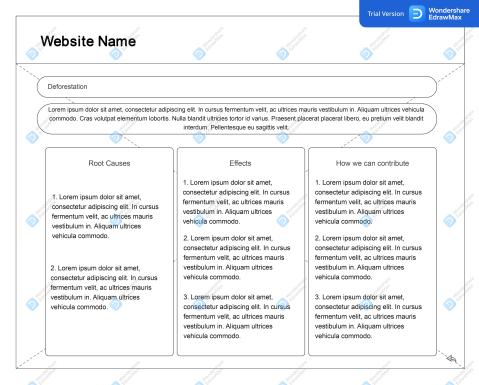

# RbPerezRamos
## The Earth Breathes Too. ##

Human activities caused severe destruction of the environment. Its advocacy to advance the world made the Earth suffer, from land, to water, to air. Humans caused too much destruction for our Earth, to the point that when it's too much, its adverse effects will not be reversable. We made this problem, so we should be the one to fix it too. This website will discuss the 4 Major Problems Caused by Human Activities, and how we can help to stop and prevent these from simple steps to worldwide movements.

Contents of this website:

1. Home (Home Page)
  - Contains the directory that leads to the subpages that contains the topics to be discussed.
    - The topics to be discussed are: 1) Deforestation 2) Pollution 3) Burning of Fossil Fuels 4) Excessive and Illegal Mining
    
2. Deforestation (Subpage 2)
  - Deforestation Source 
  - Its after effects
  - How we can lessen deforestation through simple steps up to mainstream solutions.
  
3. Pollution (Subpage 3)
  - Types of Pollution
    - Land Pollution
    - Water Pollution
    - Air Pollution
  - Its socio-economic effects in the world.
  - How to stop polluting.

4. Burning of Fossil Fuels Subpage 4)
  - Importance of Limited Fossil Fuels
  - Why fossil fuels should not be consumed
  - How to conserve fossil fuels in a simple way

5. Excessive and Illegal Mining
  - Illegal Mining that causes to excessive hoard of minerals.
  - How the government can help to avoid illegal mining.
  - How we can help as members of the society and as ones who live in the environment.

The images below are the wireframes for our website.

